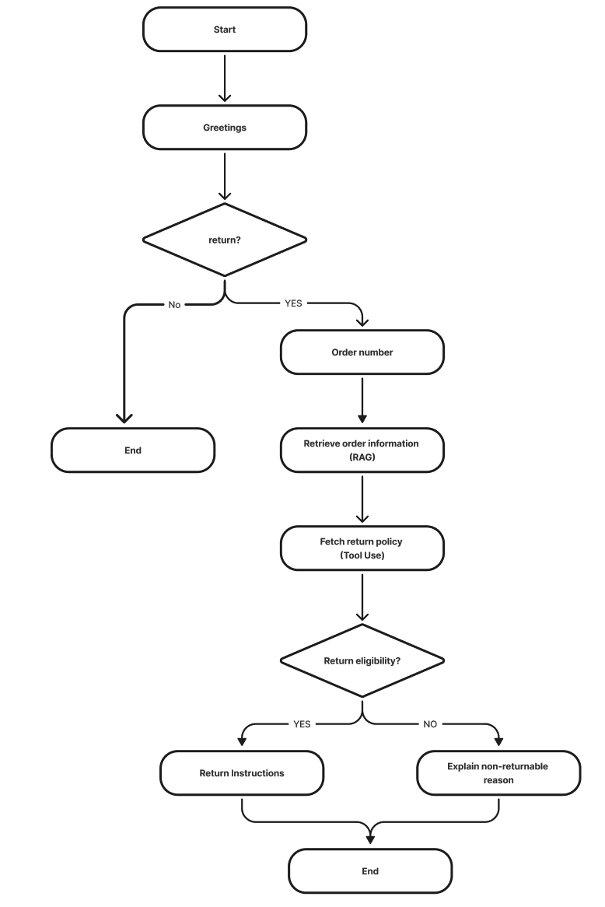

# Online Shopping Customer Service Assistant (LangGraph + RAG)

## Introduction

This project demonstrates the implementation of an "augmented building block" approach to build an intelligent customer service agent. As defined by Anthropic, the fundamental building block of modern agentic systems is an LLM enhanced with augmentations such as retrieval, tools, and memory. This allows AI systems to actively leverage capabilities beyond their base knowledge - generating appropriate search queries, selecting tools, and determining what information to retain.

Our Amazon returns assistant showcases this approach by augmenting a large language model with:

1. **Retrieval-Augmented Generation (RAG)** - Enables the agent to access order information not found in its training data
2. **Tool Use** - Incorporates specialized tools for retrieving return policies
3. **State-Based Memory** - Uses LangGraph to maintain conversation context across multiple interactions
4. **Real-time Data Integration** - Incorporates current date information for accurate eligibility assessments

By implementing these augmentations with clear interfaces, we create a modular and powerful agent that overcomes the limitations of a standalone LLM while maintaining a clean, maintainable architecture.

The agent handles Amazon return inquiries by guiding customers through the return process, retrieving their specific order information, determining return eligibility, and providing personalized instructions - all while maintaining a natural conversational flow.

## Features

- **Conversational Interface**: Natural dialogue system that understands user intents
- **Order Information Retrieval**: Looks up orders by order number using vector similarity search
- **Return Eligibility Checking**: Assesses if items are eligible for return based on current date and order date
- **Return Policy Information**: Provides detailed instructions on return process
- **Multi-turn Conversation**: Handles multiple inquiries in a single session
- **Real-time Date Awareness**: Uses current date to make accurate eligibility determinations

## Project Structure

```
.
├── agent/                  # Agent-specific components
├── prompts/                # LLM prompt templates
├── rag/                    # Retrieval Augmented Generation components
│   ├── retriever.py        # Order information retrieval logic
│   └── vectorstore/        # Vector embeddings (not in git)
├── tools/                  # Custom agent tools
│   └── return_policy_tool.py  # Return policy information tool
├── order_information/      # Sample order data
├── conversation_examples/  # Example conversations
├── main.py                 # Main agent implementation with LangGraph
├── architecture.md         # Architecture documentation
├── agentic_flow.md         # Flow diagrams and explanations
├── requirements.txt        # Project dependencies
└── .env                    # Environment variables (not in git)
```

## Example Output

Example output:
Agent: Hi! How can I help you today?
You: hi
Agent: How can I help you?
You: I want to return an item ordered from Amazon
Agent: Could you please provide your order number?
You: 1089435627
Agent: Searching for order 1089435627...
Agent: I found your order:
Product category: Essential Oil Diffuser
Brand: AromaWave
Description: Ultrasonic aroma diffuser with LED color lights, 400ml tank, quiet operation, auto shut-off, and 4 timer settings.
username: sarah.li@icloud.com
Order date: 2025-05-12
Order number: 1089435627
Order status: received
isPrime: true
Address:

Street: Sunflower Road

Suite: Suite 308

City: Mapleview

Zipcode: 32170-8579
Agent: Checking return policy...
Agent: Based on the information provided, your order of the AromaWave Essential Oil Diffuser is eligible for return. The order was placed on 2025-05-12 and today's date is 2025-05-20. According to Amazon's return policy, most items can be returned for a refund or replacement/exchange within 30 days of delivery as long as they are in original or unused condition. Your order falls within this 30-day return window.

To initiate the return, please follow these steps:

1. Go to your Amazon account and navigate to 'Your Orders'.
2. Find the order number 1089435627 and click on 'Return or Replace Items'.
3. Select the reason for the return from the drop-down menu.
4. Choose the method of refund. Please note that the refund timeline varies depending on the method chosen.
5. Print the return label and authorization.
6. Package the item in its original packaging and attach the return label.
7. Drop off the package at the nearest Amazon return center.

Once Amazon has received the item and determined that you are eligible for a refund, it can take up to 30 days for us to process your return. If we need additional information about your return, we will notify you with instructions to contact Customer Service. For more information, please see our Refunds page.
Agent: Is there anything else I can help you with?
You: That's all thank you
Agent: Thanks for chatting. Have a great day!

## How It Works

### State Machine Architecture

This project uses LangGraph to implement a state machine for conversation flow:

1. **Greeting State**: Initiates the conversation
2. **Intent Detection**: Identifies if the user wants to return an item
3. **Order Number Collection**: Prompts for and collects the order number
4. **Order Retrieval**: Uses RAG to look up order information
5. **Policy Fetching**: Retrieves relevant return policies
6. **Eligibility Checking**: Determines if the order is eligible for return
7. **End State**: Gracefully terminates the conversation

 

### RAG System

The order retrieval system uses:
- **Vector Embeddings**: Order information is embedded into vectors using OpenAI embeddings
- **FAISS Vector Store**: For efficient similarity search
- **Order Validation**: Ensures the retrieved order matches the requested order number

### Return Policy Analysis

The agent uses:
- **Current Date Awareness**: Gets the current date to calculate eligibility
- **Policy Interpretation**: Compares order date against policy windows
- **LLM Reasoning**: Uses an LLM to generate accurate eligibility assessments

## Setup and Running

### Prerequisites

- Python 3.8+
- OpenAI API key (for embeddings and language model)

### Installation

1. Clone the repository:
```bash
git clone https://github.com/yourusername/amazon-return-agent.git
cd amazon-return-agent
```

2. Install dependencies:
```bash
pip install -r requirements.txt
```

3. Create a `.env` file in the project root with your API keys:
```
OPENAI_API_KEY=your_openai_api_key
```

4. Build the vector database:
```bash
python rag/ingest.py
```

### Running the Agent

Start the agent with:

```bash
python main.py
```

Interact with the agent via the command line interface.

### Testing

Test the order retrieval system:

```bash
python rag/retriever.py
```

This will run example queries against the order database to verify it can find orders correctly.

## Future Improvements

- Web interface for easier interaction
- Support for more complex return scenarios
- Integration with actual order databases
- Multi-language support
- Enhanced error recovery 